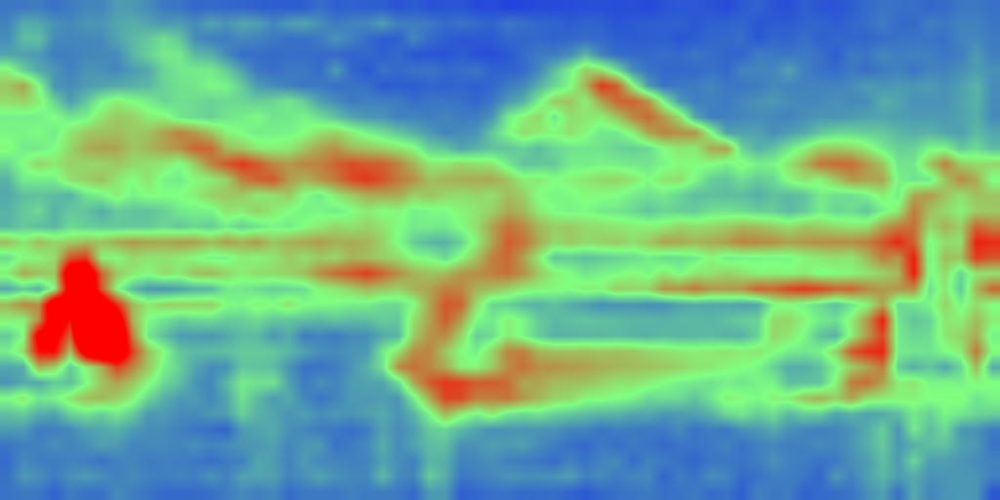

# FLUX.2 coarse-global/local-fusion falsification experiment

Date: 2026-08-29

## Question and boundary

This experiment tested whether one reduced-resolution whole-canvas FLUX.2
prediction can govern high-resolution crop predictions within one persistent
full-canvas Euler trajectory.

It did not add production nodes, a generalized execution engine, selected-token
execution, K/V caching, adaptive selection, SpotEdit machinery, or cross-model
abstractions.

The experiment separates two questions:

1. Does the reduced global prediction improve cross-region composition over
   tiled-only generation?
2. Can local predictions add high-resolution information without replacing the
   global composition?

## Implementation

Harness:
`experiments/flux2_coarse_global_local_falsification.py`

Raw report and images:
`experiments/flux2_coarse_global_local_results/`

The harness uses native ComfyUI model loading and conditioning, FLUX.2 Klein 4B
W4A8, CFG 1, and a zero-churn Euler loop with exactly one experimental
prediction assembly per accepted step. Each assembly can issue multiple ordinary
model forwards, but the sampler receives exactly one full-canvas denoised
estimate.

The four definitions are:

```text
A dense = full-canvas model denoised estimate

B tiled = normalized overlap-weighted local denoised estimates

C global = bilinear map of reduced-resolution whole-canvas denoised estimate

D fused(alpha) = mapped_global
                  + alpha * normalized_overlap_sum(
                      local - mapped_global_crop
                    )
```

For the reduced global call, RoPE coordinates are scaled so its first and last
tokens map to the first and last target-canvas token coordinates. Local crops
use full-canvas RoPE offsets. Crop coverage is explicitly accumulated and must
be strictly positive everywhere.

With normalized complete crop coverage, `alpha=1` algebraically reduces to the
tiled prediction at a given evaluation. It is retained as a control. Tiny
floating-point differences after the first assembly feed back through later
nonlinear model calls, so the independently sampled final trajectories are not
bit-identical.

## Controlled parameters

| Parameter | Value |
|---|---|
| Model | FLUX.2 Klein 4B W4A8 |
| Prompt | one continuous red suspension bridge, one centered yellow train, one left lighthouse, one right stone tower |
| Seed | 20260829 |
| Sampler | Euler, zero churn |
| CFG | 1.0 |
| Accepted steps/evaluations | 4 |
| Sigmas | 1.0, 0.9604167, 0.8858567, 0.7303661, 0.0 |
| Target canvas | 1024 x 512 pixels; 64 x 32 latent/image-token grid; 2048 image tokens |
| Reduced global | 512 x 256 pixels; 32 x 16 token grid; 512 tokens |
| Local crop | 512 x 512 pixels; 32 x 32 token grid; 1024 tokens |
| Crop layout | x offsets 0, 24, 32 latent tokens; y offset 0 |
| Overlap | 128 pixels / 8 latent tokens |
| Correction strengths | 0.25, 0.5, 0.75, 1.0 |

The prompt was deliberately designed to expose duplicate objects, broken
long-range geometry, and asymmetric left/right failures rather than emphasize
texture.

## Instrumentation and integrity checks

Every evaluation in `report.json` records:

- variant, accepted step, sigma, and evaluation identity;
- every model-call role, latent input resolution, image-token count, geometry,
  RoPE mapping, prediction statistics, and time;
- forwards and summed image-token work per accepted step;
- global, mapped-global, assembled, and correction norms/RMS;
- correction/global norm ratio;
- coverage min/max and finiteness;
- sampling wall time and CUDA peak allocation.

The geometry dry run established complete coverage with min=max=1.0. The real
smoke run completed all paths and decoding with finite values. In that smoke
run, alpha 1 versus tiled ended within max absolute `4.77e-7`.

In the composition run, every variant remained finite and every assembly had
coverage min=max=1.0. The independent alpha-1 and tiled trajectories ended with
mean absolute difference `0.00717` (max `0.545`) because floating-point
assembly differences were recurrently amplified; their final images remained
visually the same scene/layout.

## Executed work and memory

Per accepted step:

| Variant | Model forwards | Approx. image-token work | Relative to dense |
|---|---:|---:|---:|
| Dense | 1 | 2048 | 1.00x |
| Tiled only | 3 | 3072 | 1.50x |
| Global only | 1 | 512 | 0.25x |
| Global + local | 4 | 3584 | 1.75x |

This full-coverage falsification experiment is not a compute-saving design.
Its purpose is semantic qualification. The measured CUDA peak allocations were
approximately 2.45 GiB global-only, 2.50 GiB tiled/fused, and 2.60 GiB dense.
These are process/model-specific allocation peaks, not a general VRAM claim.

Wall times were 0.74 s global-only, 3.19 s tiled-only, 3.75–3.85 s fused, and
9.51 s dense. Dense ran first and includes model warmup, so these timings are
secondary and not a speed comparison.

## Results

### A. Dense reference


Dense produced the requested single coherent bridge, one centered train, one
left lighthouse, and one right stone tower. This confirms that the model,
prompt, seed, schedule, and target aspect ratio can express the intended scene.

### B. Tiled only


Tiled-only maintained sharp local structure but failed global composition. It
generated multiple bridge spans/towers, multiple train segments, and an extra
lighthouse. Overlap removed hard seams but did not provide one scene plan.

### C. Reduced global only


Global-only preserved the important whole-scene relationships: one continuous
bridge, a centered train, left lighthouse, and right stone tower. It was visibly
blurred/ghosted and lacked high-resolution fidelity, as expected from mapping a
512-token prediction to 2048 positions.

This is credible positive evidence for question 1: the reduced whole-canvas
prediction contained a materially better cross-region scene plan than the
local-only calls.

### D. Scalar global + local residual


At alpha 0.25, global composition remained recognizable and high-frequency RMS
increased from 0.240 (global-only) to 0.278. However, the result remained
substantially blurred and recovered little useful local fidelity.


At alpha 0.5, high-frequency RMS rose to 0.387, but crop-local semantic plans
became visible: extra bridge towers/spans, duplicated train structure, and
additional distant objects. Local corrections were already replacing global
composition rather than merely refining it.


At alpha 0.75, local sharpness was useful but the result largely adopted the
tiled scene, including multiple incompatible bridge structures and duplicated
objects. Alpha 1 reproduced tiled behavior, as predicted by the fusion algebra.

Quantitatively, low-frequency distance from global-only and high-frequency RMS
both rose monotonically with alpha:

| Variant | Low-frequency MAE vs global-only | High-frequency RMS | Gain over global-only |
|---|---:|---:|---:|
| Global only | 0.000 | 0.240 | 0.000 |
| Fused 0.25 | 0.085 | 0.278 | 0.038 |
| Fused 0.50 | 0.205 | 0.387 | 0.147 |
| Fused 0.75 | 0.311 | 0.550 | 0.309 |
| Fused 1.00 | 0.377 | 0.731 | 0.491 |
| Tiled only | 0.377 | 0.731 | 0.490 |

There was no scalar setting in this sweep that both retained the global scene
and recovered strong local fidelity.

## Failure diagnosis

The failure is not primarily incomplete coverage or an obvious coordinate
error:

- coverage was exactly complete and normalized;
- crop RoPE offsets and global extent mapping were explicit;
- tiled images aligned continuously through overlaps, even though their scene
  content was incompatible;
- global and local prediction RMS values were of similar scale.

The correction itself was too semantic and too large to be interpreted as
detail. Its norm was 0.64 times the mapped-global norm at step 0 and roughly
0.72–1.07 across later evaluations. Correction-magnitude maps covered bridge
geometry, towers, train placement, lighthouses, horizon, and water regions—not
only edges or texture.



Intermediate estimates show the divergence early. At step 0, the global branch
already proposed one coherent long bridge, while local calls proposed different
bridge slopes, supports, and objects. Scalar residual addition therefore mixes
competing low-frequency/semantic predictions. Raising alpha cannot selectively
recover detail; it necessarily transfers the local alternative scene.

Noisy-latent resizing distribution shift may contribute to the global branch's
blur/ghosting, but it does not explain the scalar fusion failure by itself: the
reduced branch consistently held the requested global arrangement, while the
unfiltered local residual visibly carried incompatible composition.

## Answers to the two questions

1. **Does the global prediction improve cross-region composition?** Yes. In
   this controlled seed/prompt, global-only preserved the requested asymmetric
   whole-scene arrangement far better than tiled-only.
2. **Can straightforward local residuals add detail without overriding it?**
   No. Low alpha preserved the plan but added little useful fidelity; moderate
   or high alpha imported crop-local scene alternatives and invalidated the
   plan.

This is one composition-stress case, so it is not broad perceptual
qualification. It is nevertheless a direct falsification of unfiltered scalar
prediction-residual fusion as the complete Candidate-1 mechanism.

## Recommendation

Do not proceed from this result to a production node or a sparse executor. Keep
the reduced global branch as a supported research hypothesis, but revise the
fusion contract so local corrections cannot freely alter low-frequency scene
structure.

The highest-value next experiment is one controlled **frequency-content
falsifier** using the same stored/evaluated predictions: split each local-minus-
global correction with one fixed spatial low-pass, compare low-pass and
high-pass correction semantics/norms, then run exactly one high-pass-only local
correction strength. This directly tests the observed cause—semantic content in
the low-frequency local residual—before considering timestep schedules,
learned fusion, or selected-token execution.

## Verdict

```text
CANDIDATE 1 NEEDS REVISION
```
