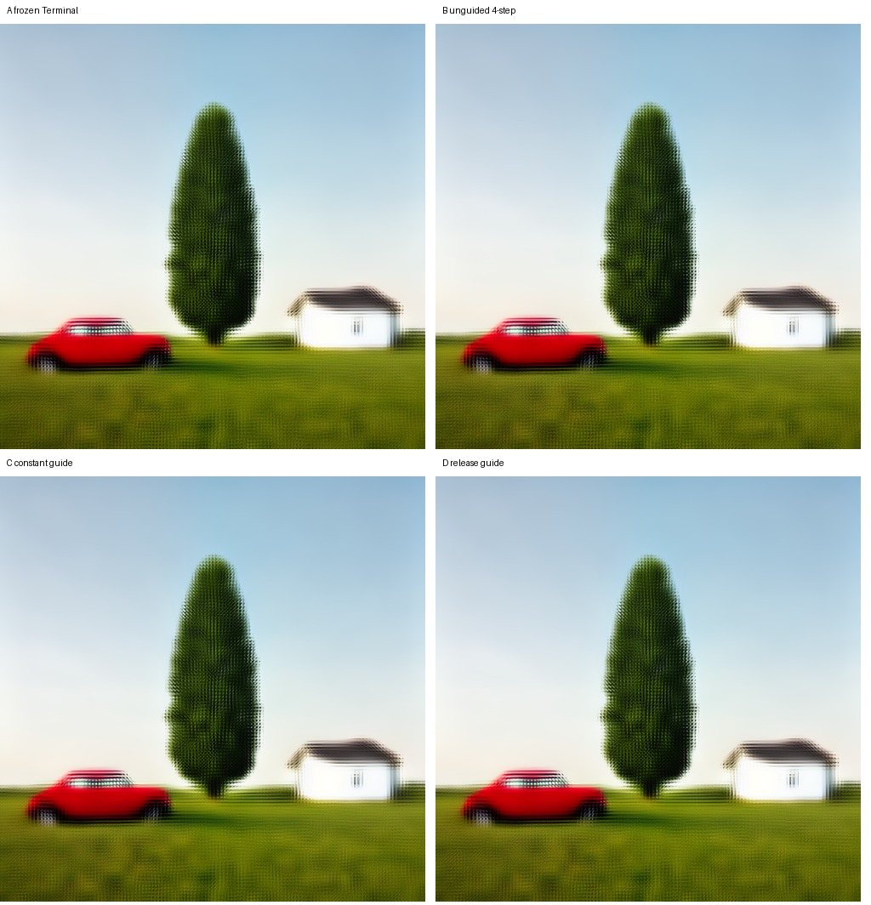

# Persistent coarse guidance discriminator

## Result

**B — S3 RETAINED, NO CREDIBLE DETAIL IMPROVEMENT**

The fixed constant and release guide policies both preserve the realized
one-car/one-tree/one-house composition, shared horizon, and perspective. They
do not credibly improve wheels, windows, car contour, foliage organization,
house structure, or ground detail over frozen Terminal Resampling or the
unguided four-interval control. Persistent guide tuning stops here.

## Exact intervention

RES4LYF commit `0d753fada0cd5ae1dd69372caee9c3e7012a5dcb` confirms that
plain linear-flow epsilon guidance forms `(W-guide)/sigma` and interpolates the
sampler epsilon/velocity toward it. The model-neutral Klein/CONST equivalent
used here is:

```text
model x0: m = model(W, sigma)
guided x0: m' = m + lambda * (guide - m)
Euler:     W_next = W + (sigma_next-sigma) * (W-m')/sigma
```

This is a sampler-level/post-model denoised-prediction operation. It is not
initial-state, model-conditioning, attention/KV, or hidden-state guidance.
Both arms use identical initial W, regional noise, sigmas, model options,
conditioning, calls, restriction, and assembly.

## Controls and policies

- frozen Terminal: persisted `[0.25,0]`, 25 calls;
- unguided depth control: persisted Phase-38 four-interval path, 100 calls;
- constant: `[0.25,0.25,0.25,0.25]`, 100 calls;
- release: `[0.5,1/3,1/6,0]`, 100 calls.

The two guide schedules have equal discrete total weight. Every initial W and
noise hash matches the frozen Terminal artifacts. At interval zero, every
pre-guide model-prediction hash matches between constant, release, and
unguided arms, proving the first divergence is the declared guide mix.

## Measurements

| Arm | Gradient RMS | Overlap RMS | RMS vs Blueprint | Low-frequency RMS vs Blueprint |
|---|---:|---:|---:|---:|
| frozen Terminal | 0.238817 | 0.173451 | 0.132498 | 0.064650 |
| unguided four intervals | 0.253632 | 0.190880 | 0.136947 | 0.058429 |
| constant guide | 0.212995 | 0.108701 | 0.078189 | 0.033693 |
| release guide | 0.225417 | 0.138210 | 0.099498 | 0.043091 |

Both guided outputs are bit-exact across independent executions. Coverage is
positive and complete, post-region CUDA allocation is flat in both runs, each
guided arm performs exactly 100 bounded `64x64` model calls, and destination-
sized model calls remain zero. Regular VAE decode exhausted the available
post-sampling allocation and automatically retried through ComfyUI's tiled VAE
decoder; this does not affect latent sampling evidence.

The lower Blueprint distance and overlap disagreement show that the operation
does impose coarse authority. The simultaneous reduction in gradient energy
and visual local development shows that it spends the extra trajectory locking
back toward the soft guide. The release policy is less restrictive but still
does not recover credible structure.



## Decision

The composition half of the gate passes; the credible-detail half fails. Do
not sweep guide strength, schedule shape, or refinement sigma. The next
architectural discriminator, if separately authorized, is recurrent/interleaved
G/W latent refresh where G is an active scene planner rather than a completed
fixed guide.

