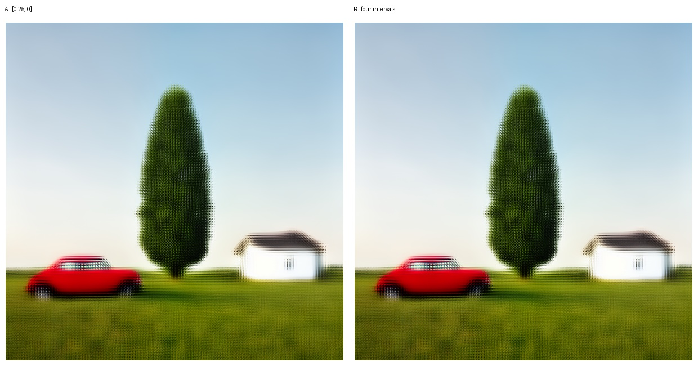
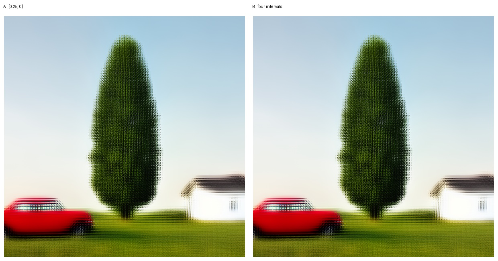

# Phase 38 — Fixed four-interval terminal local trajectory discriminator

## Result

**B — CHANGES OUTPUT BUT DOES NOT SOLVE SOFTNESS**

Phase 38 tests one newly authorized empirical Blueprint schedule. It is not
canonical Klein partial denoising, Diffusers `strength=0.25`, or a
parameter-free consequence of Phase 37.

The four-interval local trajectory retained the qualified S3 composition and
was bit-exact on an independent repeat. It increased fine line/gradient energy,
but did not credibly improve the car, tree, house, or ground structure. The
additional work therefore changes texture and contours without resolving the
terminal-resampling softness bottleneck.

## Fixed contract

- Case: `SQUARE_MULTI_OBJECT`
- Destination: `128x128` latent
- Blueprint: persisted qualified `45x45` terminal prediction
- Regions: 25 ordered `32x32` crops
- Working state: independent persistent `64x64` W trajectory per region
- Model: native ComfyUI FLUX.2 Klein 4B, CFG 1
- Blueprint feedback: none
- Inter-region communication: none
- Restriction/assembly: one final exact `avgpool2`, then unchanged normalized
  overlap assembly

The control is the persisted qualified Phase-29/31 one-step result with hash:

```text
1b61a401451c5838cd0370897c9d9d4e838a23f497c76490f4549e68aecd1de3
```

It reproduced bit-exactly before experimental inference was interpreted.

## Empirical schedule derivation

Using the authorized BFL shifted-flow coordinate and fixed Phase-37 value
`mu=2.291179894115571`:

```text
shift(u; mu) = exp(mu) / (exp(mu) + (1/u - 1))
u_start = sigma_start / (exp(mu)*(1-sigma_start) + sigma_start)
u_i = u_start * (1 - i/4), i=0..4
sigma_i = shift(u_i; mu)
```

The exact executed Python-double schedule was:

```text
[0.25,
 0.1986604057521303,
 0.14082231971176423,
 0.07516852136507746,
 0.0]
```

Only `mu`, `sigma_start`, and the authorized four-interval count are declared
inputs; intermediate values are analytically reconstructed.

## Lifecycle

Each region used the exact control noise and initial working state:

```text
W_0.25 = noise_scaling(0.25, epsilon_region, nearest2(Blueprint crop))
```

Every region's control noise hash and initial W hash matched Phase 29. No noise
was regenerated between intervals. Each update was:

```text
x0_i = guider(W_i, sigma_i)
v_i = (W_i - x0_i) / sigma_i
W_next = W_i + (sigma_next - sigma_i) * v_i
```

The final W at zero was restricted and assembled once. There was no
intermediate destination assembly, Blueprint update, post-anchor, projection,
global K/V, or local-to-global feedback.

## Quantitative comparison

| Metric | A: `[0.25,0]` | B: four intervals |
|---|---:|---:|
| Semantic grade | S3 | S3 |
| Local model calls | 25 | 100 |
| Gradient RMS | 0.238817 | 0.253632 |
| Overlap RMS | 0.173451 | 0.190880 |
| RMS vs mapped Blueprint | 0.132498 | 0.136947 |
| Low-frequency RMS vs Blueprint | 0.064650 | 0.058429 |
| Local CUDA time | 24.588 s | 98.768 s |
| Wall time | 25.132 s | 101.801 s |
| Peak allocated CUDA | 3,046,472,704 B | 3,027,533,312 B |
| Peak reserved CUDA | 3,560,964,096 B | 3,539,992,576 B |

Candidate versus control latent RMS was `0.0270475` (maximum absolute
`0.2048171`). Region-barrier allocation was flat at `2,504,251,904` bytes for
all 25 primary regions. The candidate used exactly four calls per region and
performed zero destination-sized model forwards.

The approximately fourfold execution cost tracks the fourfold model-call
count; peak VRAM remains effectively unchanged because only one region-local W
trajectory is resident.

## Determinism and persistence

- Candidate latent hash:
  `f5cdef1a0bd8ffb76e8ec912d3a6ef1a0541bb9cc23f1f390edad57d7030768f`
- Independent repeat: bit-exact
- Resume unit: one completed region
- Every region artifact includes schedule, mapped Blueprint, base noise,
  initial W, every step state/prediction hash, restricted prediction hash,
  timing, and barrier allocation.
- Representative background/car/tree/house artifacts persist every W and x0
  tensor boundary.
- Coverage remained positive and output tensors finite.

## Semantic review

Both arms contain exactly one red car, one dominant central tree, and one white
house on a coherent shared field and horizon. B introduces no duplicate object
system or crop-local recomposition, so Blueprint authority remains intact.

However, B does not turn the extra evaluations into credible structural
detail:

- car wheels, windows, roof/body contour, and bumper remain comparably soft;
- foliage becomes denser in line energy but not more convincingly organized;
- house roof/window structure is not materially resolved;
- grass gains fine texture density without clearer semantic ground structure.

The gradient increase is accompanied by worse overlap disagreement and greater
overall Blueprint RMS. Although low-frequency RMS improves slightly, the visual
gain is texture/alias-like rather than useful native detail.





## Decision

The four coherent late Euler evaluations preserve S3 but do not solve
softness. Do not sweep interval count, start sigma, or schedule spacing. Stop
terminal-local depth experiments under this initialization-only contract.

The next research question should move upstream to a model-mediated
Blueprint-to-working representation or an explicitly guided/interleaved
architecture capable of maintaining Blueprint authority while creating shared,
compatible detail. That would be a separate architecture; Phase 38 contains no
local-to-Blueprint feedback and is not interleaved global/local sampling.

**B — CHANGES OUTPUT BUT DOES NOT SOLVE SOFTNESS**
