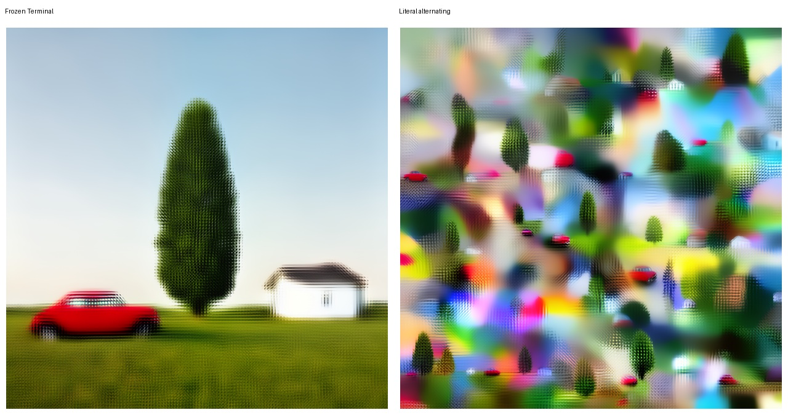

# Literal alternating-resolution Blueprint prototype

## Verdict

**FAIL — the literal interpolation-only alternating prototype fails S3.** It
replaces the requested single car/tree/house scene with many locally complete
prompt interpretations and destroys the continuous horizon. This result is
narrow: it does not establish that every possible interleaved architecture
fails.

## Executed contract

- S3 prompt and seed `20260921`;
- `G=45x45`, `H=128x128`, `F=32x32`, stride `24x24`, `W=64x64`, 25 regions;
- sigmas `[1.0, 0.9991771578788757, 0.9975355267524719,
  0.9926428198814392, 0.0]`;
- interval ownership exactly `G, W, G, W`.

Each G interval performs an ordinary prediction and Euler update. The accepted
post-update G tensor is transferred directly, at unchanged sigma, through the
halo-equivalent bilinear G-to-H mapping, footprint crop, and bilinear F-to-W
resize. Each W interval performs an ordinary prediction and Euler update per
region. Accepted W tensors are area-restricted to F, normalized-overlap
assembled into H, bilinearly downscaled to G, and replace G outright at the
same sigma.

There are no `x0_G` transfers, `noise_scaling()` calls, regional RNG calls,
fresh reconstruction, persistent H, delta exchange, blending, projection,
guidance, or special positions. Direct interpolation of noisy states does not
preserve a known per-resolution diffusion/noise distribution; that ambiguity
is intentionally left uncorrected.

## Causal telemetry

The machine-readable report records every transition's owner and input/output
sigma, accepted G hashes around both G updates, the shared accepted-G hash used
by all 25 W regions, every W hash immediately after resize, every accepted W
hash before restriction, every F hash after restriction, both assembled-H
hashes before downscale, and both replacement-G hashes after downscale.

Both W intervals verify that every region derives from the same immutable
accepted G. The independent repeat is bit-exact with final H hash
`a398ad02d7cf4ac5a0078a88afce09e61b57ac8ddcf755a71417da9f043dd647`.

## Geometry, disagreement, and residency

- Per run: 2 bounded G calls at `1x128x45x45` and 50 bounded W calls at
  `1x128x64x64`; zero H-sized model calls.
- Normalized coverage is `1.0..1.0000001192` in both W intervals.
- Overlap RMS is `0.0242043` after the first W interval, then `0.6462023` after
  the terminal W interval. Frozen Terminal is `0.1734514`.
- Peak CUDA allocated/reserved is `3,031,506,944 / 3,481,272,320` bytes.
- Allocation is exactly flat across region index within each W interval. The
  interval barriers differ by 8,454,144 bytes because the accepted state across
  the intervening G interval remains live; this is not completed-tile growth.
- Primary wall time is `51.74 s`. Preview decoding used ComfyUI's tiled VAE
  fallback outside diffusion execution.

## Semantic result

The literal arm contains many cars, trees, and houses, repeated scene patches,
inconsistent scale/perspective, and no coherent continuous horizon. Its high
gradient RMS (`0.341463`) is fragmentation, not useful structural refinement.
It is `0.990400` latent RMS from Frozen Terminal.

## Stop decision

Report exactly that this literal prototype failed. Do not reinterpret the
result as rejection of all recurrent/interleaved multiresolution sampling, and
do not introduce a corrective mechanism under this experiment.

