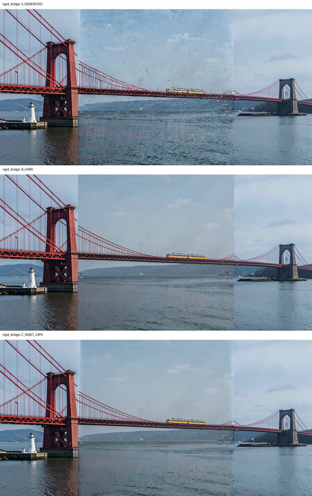
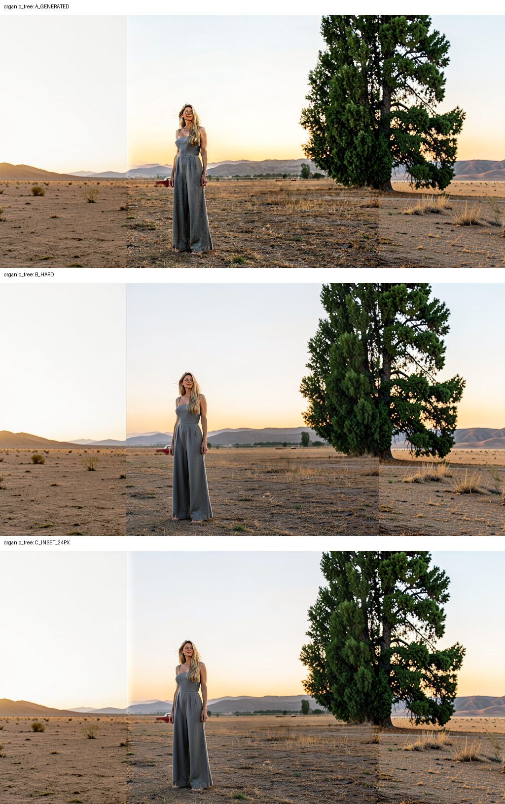
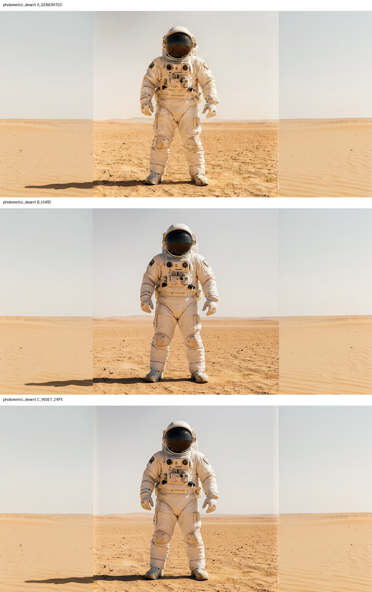

# Local Edit fixed-policy compositing robustness discriminator

Date: 2026-09-09

## Verdict

**Do not qualify the fixed 24-pixel inward composite as the default source-
preservation mechanism.** It preserves the exact source interior and generated
exterior in every case, and it does not create doubled structural contours, but
it is not photometrically robust. The predominantly photometric desert case
shows an obvious full-height vertical tonal band even though nominal-boundary
scalar metrics return to the generated control's values.

The rigid bridge remains a qualified single-case success. The organic tree case
is structurally safe: the contour stays single and continuous. Both the organic
and photometric cases retain visible tonal transitions, with the photometric
case clearly failing the no-obvious-seam requirement.

No production source or registration changed.

## Frozen policy

Every case uses exactly:

```text
source footprint R = pixel columns [256,768)
24 px inward raised-cosine transition = [256,280) and [744,768)
exact source interior = [280,744)
generated image exactly outside R
```

There is no diffusion-mask blur, latent restoration, warping, alignment,
per-image offset, or parameter adjustment. The same source-weight vector from
the qualified bridge discriminator is reused byte-for-byte.

## Case qualification before compositing

| Case | Boundary content | Epsilon A screen |
|---|---|---|
| Rigid bridge | Deck and suspension cables cross both boundaries | Pass: one bridge, compatible scale, no independent restart |
| Organic tree | Tree canopy/trunk crosses the right boundary | Pass: one continuous tree and one intact woman, without duplicate objects |
| Photometric desert | Sky, horizon, sand, and shadow texture | Pass: one astronaut and continuous landscape geometry |

Two earlier organic source layouts were rejected before compositing. One cut an
astronaut off at the boundary; the other duplicated a car and truncated a
person. Those are epsilon-generation failures and are not counted as composite
failures or rescued by blending.

## Mechanical invariants

All three C outputs satisfy:

- source-interior MAE exactly zero;
- source-interior exact-pixel fraction exactly 1;
- generated exterior bit-exact to A, maximum difference zero;
- transition support wholly inside R;
- unchanged 24-pixel width and raised-cosine weights.

Full-footprint exact-source fractions are `91.9224%` for the bridge, `91.9701%`
for the tree, and `92.1036%` for the desert. Only pixels in the declared two
transition strips may differ.

## Scalar results

The table reports left/right nominal-boundary RMS. C equals A at these exact
boundaries by construction because its source weight is zero there.

| Case | Arm | Seam gradient RMS | First-derivative discontinuity RMS | Transition MAE vs source |
|---|---|---:|---:|---:|
| Rigid bridge | A generated | 0.112553 / 0.055373 | 0.108146 / 0.065170 | 0.058942 |
|  | B hard | 0.123365 / 0.086161 | 0.134881 / 0.103653 | 0 |
|  | C inset | 0.112553 / 0.055373 | 0.108146 / 0.065170 | 0.035431 |
| Organic tree | A generated | 0.035488 / 0.144375 | 0.035618 / 0.208309 | 0.062041 |
|  | B hard | 0.092850 / 0.181956 | 0.098322 / 0.265430 | 0 |
|  | C inset | 0.035488 / 0.144375 | 0.035618 / 0.208309 | 0.035184 |
| Photometric desert | A generated | 0.032333 / 0.029884 | 0.031725 / 0.036199 | 0.044780 |
|  | B hard | 0.075627 / 0.091130 | 0.074031 / 0.093131 | 0 |
|  | C inset | 0.032333 / 0.029884 | 0.031725 / 0.036199 | 0.025089 |

These measurements confirm exactness and show that C avoids B's single-column
jump. They do not prove perceptual seamlessness: C can distribute a luminance
mismatch across 24 pixels and score well at the nominal edge while forming a
visible band inside R.

## Per-case visual assessment

### Rigid bridge



The bridge deck, cables, train, towers, and scale remain coherent. C does not
double an edge or alter the generated exterior. A narrow sky/water tonal
transition remains, consistent with the prior qualified bridge result.

### Organic tree



The tree remains one continuous object across the right boundary. No second
trunk, doubled canopy edge, ghost branch system, or 24-pixel blur contour is
visible. The woman and source detail are restored exactly in the interior.
There is nevertheless a visible vertical photometric transition, especially at
the left open-sky/ground boundary. This is not geometric displacement.

### Photometric desert



A has one astronaut and a coherent horizon. B produces sharp vertical source-
replacement seams. C spreads the mismatch inward, but an obvious full-height
tonal band remains in the smooth sky and sand at both boundaries. There is no
object ghosting to explain it: this is a direct photometric-policy failure.

## Evaluation by requested category

- **Photometric seam:** fail overall; C is visibly banded in the desert case.
- **Geometric displacement:** no new displacement introduced by C in eligible
  cases.
- **Doubled/ghost contour:** none observed for bridge or tree.
- **Exact-source fraction:** invariant passes in every case; exact interior is
  100% and full-footprint exactness is about 92%.
- **Source identity/detail:** exact in the declared interior; transition detail
  is necessarily mixed.
- **Generated-exterior identity:** bit-exact in all cases.

## Decision

Retain the fixed compositor as a useful reference and exactness contract, but
do not designate it the default Local Edit source-preservation mechanism. The
fixed width is structurally safe on the three eligible cases but fails
photometric robustness on smooth low-texture content.

Do not widen the transition or tune per image. Where an epsilon A already has
geometric disagreement, continue to classify that as a generation failure.
Any next compositing research must target photometric reconciliation explicitly
without weakening exact interior/exterior ownership or hiding structural
failure.

The generation harness is
[local_edit_composite_robustness_generate.py](local_edit_composite_robustness_generate.py),
the fixed-policy harness is
[local_edit_composite_robustness.py](local_edit_composite_robustness.py), tests
are [test_local_edit_composite_robustness.py](test_local_edit_composite_robustness.py),
and outputs and metrics are in
[local_edit_composite_robustness_results](local_edit_composite_robustness_results/).
