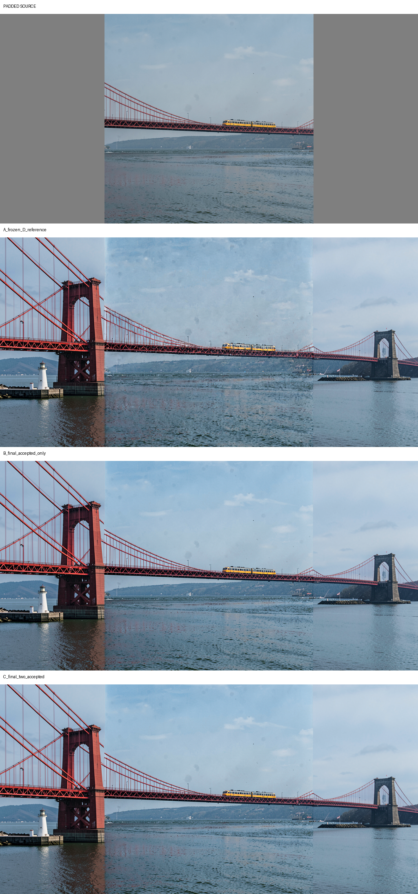

# Local Edit late source-restoration discriminator

Date: 2026-09-09

## Verdict

Terminal source restoration does **not** satisfy the continuation gate. It
preserves reproduced arm D's single-bridge geometry and makes the terminal
source latent exactly equal to the encoded source, but decoded source-region
MAE becomes worse, not better. Restoring the final two accepted intervals gives
no compensating improvement.

Therefore the requested narrow source-mask inset/overlap follow-up is not
authorized by this result. This is not the early hard-lock failure: neither late
arm restarts an independent bridge. It is a source-fidelity failure caused at
the full-canvas decode boundary despite exact source latent coordinates.

No production node, registration, sampler, or Blueprint component changed.

## Fixed contract

All arms retain the exact reproduced D configuration:

- FLUX.2 Klein 4B W4A8, CFG 1, seed 0;
- eight-step Flux2 schedule and RES4LYF `linear/euler`;
- identical prompt and initial latent;
- Clown `epsilon_projection`, non-channelwise, weight 1, cutoff 1, constant;
- the same direct guide-mask polarity;
- no native `noise_mask`;
- full-canvas model-visible state and projected correction unchanged before
  each model call.

The experiment-only hook runs after RES4LYF assigns the Euler proposal to its
accepted `x`. On selected intervals it applies

```text
x_next = M_edit*x_proposal + M_source*((1-sigma_next)*y + sigma_next*z)
```

using one fixed initial state `z` captured at sigma 1. The source mask is binary
and occupies latent columns 16 through 47. There is no blur or overlap.

The unchanged scheduler's last explicit Euler target is
`sigma=0.0007533399`, after which RES4LYF performs its post-loop conversion to
the effective terminal denoised state. B and C therefore also restore clean
`y` at that real terminal state. No extra model evaluation is introduced.

## Arms and integrity

| Arm | Accepted-state restoration |
|---|---|
| A | None; frozen reproduced D reference |
| B | Step 7 landing plus effective terminal clean-source restoration |
| C | Step 6 landing, step 7 landing, plus effective terminal clean-source restoration |

A is bit-exact to the previously saved D sampled latent: RMS and maximum error
are both zero. B is bit-exact to A through accepted step 6 and first diverges at
step 7. C is bit-exact through step 5 and first diverges at step 6. This proves
that early full-canvas model-visible evolution is unchanged.

All four algebra/lifecycle tests pass: binary source-center polarity, correct
CONST trajectory, terminal clean-source identity, source-only proposal
replacement, and declared divergence intervals.

## Results

Metrics below use the returned terminal accepted latent and its full-canvas VAE
decode. Latent RMS is evaluated with zeros outside the source mask, consistently
across arms.

| Arm | Source latent RMS vs y | Source latent max | Decoded source MAE | Decoded source max | Editable decoded change RMS | Left/right seam gradient RMS |
|---|---:|---:|---:|---:|---:|---:|
| A frozen D | 0.242516 | 1.873525 | **0.031628** | 0.707031 | 0.238692 | 0.112452 / 0.055320 |
| B final only | **0** | **0** | 0.040609 | 0.510254 | 0.242090 | 0.116452 / 0.054507 |
| C final two | **0** | **0** | 0.041177 | 0.556641 | 0.247360 | 0.114317 / 0.053520 |

B's terminal replacement changes the accepted source state by RMS `0.242061`.
C changes it by `0.430107` at step 6, `0.285607` at step 7, and only
`0.000402` at the terminal cleanup. Each selected source target has zero error
immediately after replacement.

Decoded source MAE remains worse even after excluding increasingly wide pixel
bands at both source boundaries:

| Source-side inset | A | B | C |
|---:|---:|---:|---:|
| 0 px | 0.031664 | 0.040668 | 0.041234 |
| 16 px | 0.029431 | 0.039082 | 0.039462 |
| 32 px | 0.028777 | 0.038505 | 0.038810 |
| 64 px | 0.028319 | 0.038184 | 0.038445 |
| 128 px | 0.028039 | 0.038174 | 0.038434 |
| 192 px | 0.028050 | 0.038243 | 0.038533 |

This is consistent with the earlier zero-diffusion locality diagnostic: exact
center latent coordinates do not isolate the decoded center from changed
editable-side latents in this VAE/full-canvas decode.

## Perceptual interpretation



- A retains the reproduced nearly continuous single bridge and its small joins.
- B retains the same bridge scale, deck continuation, towers, and train. It does
  not create a restarted bridge or new duplicate structure. The vertical joins
  remain visible and the left seam metric increases slightly.
- C likewise retains the main geometry but provides no visible or measured
  advantage over B. Its editable region changes slightly more and decoded
  source error is marginally worse.
- Both late arms retain substantial edit freedom.

The bridge geometry is therefore largely formed before the late restoration,
as hypothesized. But exact late latent authority is not equivalent to improved
decoded source fidelity when the edited full canvas is decoded jointly.

## Decision

Do not run the conditional source-mask inset/overlap arm: final-only restoration
did not substantially improve decoded source fidelity. Do not characterize this
as the independent-bridge failure seen with hard locking from step zero; that
failure did not recur.

No further sampler-state-restoration sweep is justified by this discriminator.
Post-decode compositing remains a separate possible source-preservation
contract, but the task's explicit trigger—terminal restoration visibly breaking
the bridge join—was not observed, so it is not implemented here.

The experiment harness is
[local_edit_late_source_restoration.py](local_edit_late_source_restoration.py),
tests are
[test_local_edit_late_source_restoration.py](test_local_edit_late_source_restoration.py),
and machine-readable telemetry plus all accepted-state previews are in
[local_edit_late_source_restoration_results](local_edit_late_source_restoration_results/).
