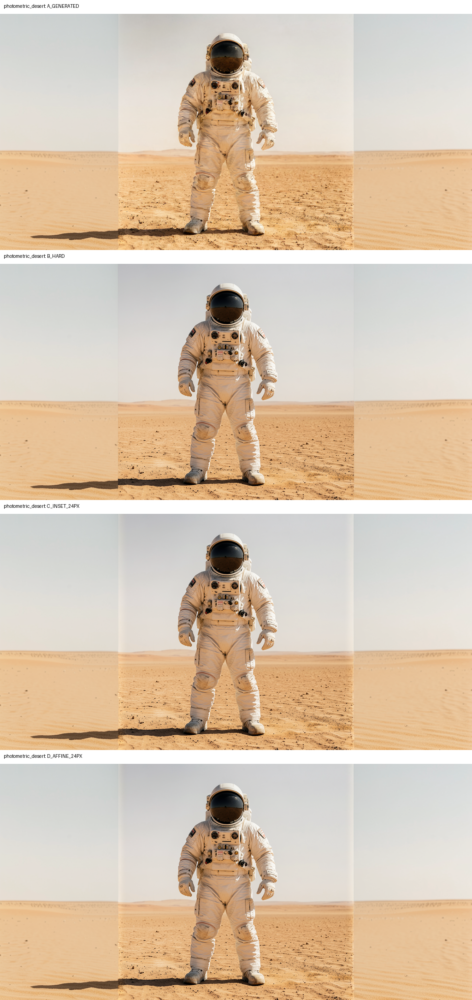
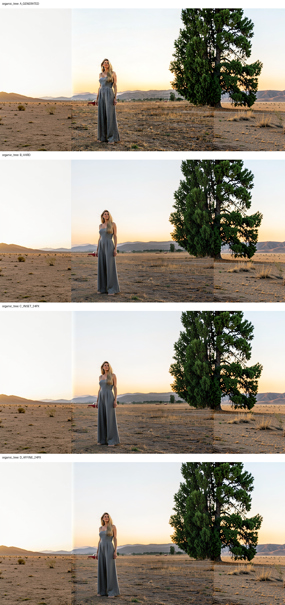
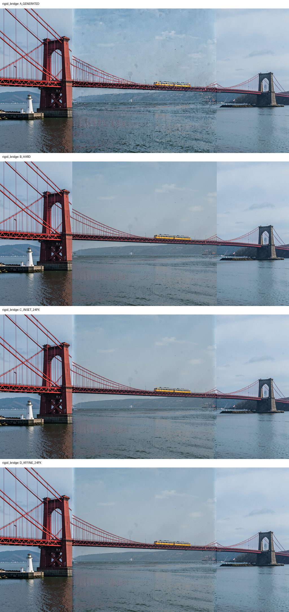

# Local Edit affine photometric-reconciliation discriminator

Date: 2026-09-09

## Verdict

**Reject and stop scalar/affine photometric reconciliation.** The deterministic
luminance-affine correction modestly reduces the desert strip's average
low-frequency residual, but the visible vertical band remains. More decisively,
the same fixed automatic policy introduces a pronounced dark/brightness halo in
the organic case's left transition and worsens its strip-level metrics.

Exact source-interior and generated-exterior ownership remain intact, and no
new doubled structural contour is visible. The failure is photometric stability
across content. The next eligible compositor family is gradient-domain or
multiband, not further scalar/affine tuning.

No diffusion, VAE, latent restoration, or production execution occurred.

## Fixed contract and transform

All cases reuse the previously qualified geometry without change:

```text
source footprint: [256,768)
transition strips: [256,280) and [744,768)
exact source interior: [280,744)
source weight: unchanged 24 px raised cosine
generated exterior: byte-exact outside source footprint
```

For each boundary independently, D estimates a luminance affine from
corresponding source/generated pixels in that boundary's 24-pixel strip:

```text
a = MAD(Y_source) / MAD(Y_generated), clipped to [0.5,2.0]
b = median(Y_source) - a*median(Y_generated)
Y_target = a*Y_generated + b
```

The luminance delta is added equally to RGB, preserving chroma before clipping.
Its strength is the unchanged source weight. It is therefore exactly zero at
the nominal outer source boundary; at the exact-interior edge, the generated
contribution itself is zero. Coefficients are wholly data-derived and never
manually tuned.

## Estimated transforms

Offsets are in 8-bit luminance units.

| Case | Boundary | Scale a | Offset b | Maximum applied delta |
|---|---|---:|---:|---:|
| Bridge | left | 0.5724 | 59.25 | 59.21 |
| Bridge | right | 0.6016 | 64.76 | 58.61 |
| Tree | left | 1.4683 | -128.41 | 127.41 |
| Tree | right | 0.9511 | 13.67 | 13.67 |
| Desert | left | 1.0612 | -23.17 | 19.21 |
| Desert | right | 1.0608 | -24.02 | 20.48 |

The large tree-left correction is not a manual outlier; it is the fixed robust
estimator's response to nonstationary content in the strip. That behavior is
part of the falsification.

## Strip-level metric

For each strip, image luminance is averaged vertically per column. A fixed
local baseline linearly joins the mean of the eight exterior columns to the
mean of eight exact-interior columns. The RMS and maximum residual across all
24 columns detect a distributed band that the nominal-edge metric misses.

| Case | Arm | Left/right baseline residual RMS | Left/right maximum deviation | Transition MAE vs source |
|---|---|---:|---:|---:|
| Bridge | C | 0.014843 / 0.005737 | 0.025945 / 0.008973 | 0.035431 |
|  | D | 0.014194 / 0.004579 | 0.025945 / 0.008479 | 0.031871 |
| Tree | C | 0.006106 / 0.032623 | 0.013100 / 0.090822 | 0.035184 |
|  | D | **0.022914** / 0.030033 | **0.042972** / 0.090822 | **0.037016** |
| Desert | C | 0.014465 / 0.019211 | 0.028637 / 0.051349 | 0.025089 |
|  | D | 0.011988 / 0.017437 | 0.028637 / 0.051342 | 0.021185 |

Desert RMS improves by about 17.1% left and 9.2% right, but maximum deviation is
essentially unchanged. Tree-left residual RMS increases by about 275%, maximum
deviation by about 228%, and transition MAE also worsens.

Complete per-column luminance means and derivatives are saved in `report.json`.

## Visual assessment

### Photometric desert



D slightly changes the strip tone, but the full-height light/dark boundary band
remains visible in both sky and sand. It does not meet the primary hypothesis.

### Organic tree



D produces a visible dark/brightness halo at the left transition. The tree
contour remains single, but this cross-case degradation independently rejects
the fixed affine rule. No doubled tree or local desaturation is needed to make
the failure decision.

### Rigid bridge



D gives small scalar improvements and preserves the bridge geometry, but it
does not compensate for the desert failure or organic regression.

## Invariants and decision

Every D arm retains source-interior exact-pixel fraction 1, generated-exterior
bit exactness, the fixed inward transition, and unchanged geometry. No color
warp or spatial warp occurs outside the transition.

The hypothesis nevertheless fails: one affine luminance statistic cannot
robustly reconcile both smooth photometric fields and structured/nonstationary
boundary content. Do not tune clipping, neighborhoods, affine channels, or
strength in this branch. Move next, if authorized, to one fixed gradient-domain
or multiband discriminator while preserving the same ownership contract.

The harness is
[local_edit_photometric_reconciliation.py](local_edit_photometric_reconciliation.py),
tests are
[test_local_edit_photometric_reconciliation.py](test_local_edit_photometric_reconciliation.py),
and outputs, coefficients, profiles, and derivatives are in
[local_edit_photometric_reconciliation_results](local_edit_photometric_reconciliation_results/).
