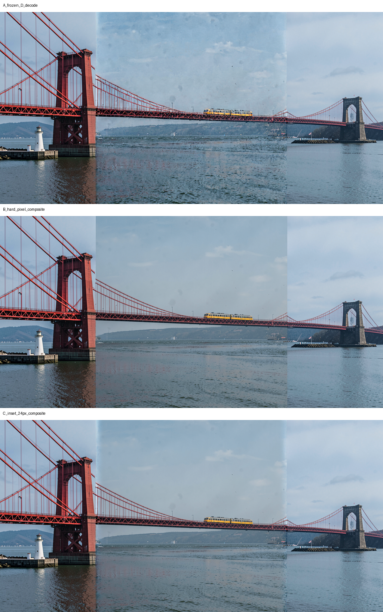

# Local Edit zero-diffusion post-decode compositing discriminator

Date: 2026-09-09

## Verdict

Post-decode compositing can combine exact source pixels with frozen D's
successful geometry. Hard compositing satisfies exactness but increases the
sharp photometric discontinuity. A predeclared 24-pixel inward raised-cosine
transition restores nominal-boundary gradient and first-derivative metrics to
frozen-D levels without changing any generated exterior pixel or creating
duplicate bridge structure.

The inset composite passes P1 and P2. It materially improves the hard
composite's narrow discontinuity and does not create bridge ghosting, but a
subtle narrow tonal transition remains visible in sky and water. This is a
photometric residual, not a structural mismatch, and does not justify widening
the strip in this task.

No diffusion or VAE execution occurred. No production source changed.

## Inputs and fixed geometry

- `S`: exact resized padded source PNG, 1024 x 512.
- `G`: frozen bit-exact D accepted-state decode.
- Nominal source footprint `R`: pixel columns `[256,768)`.
- Transition width: 24 pixels per boundary, selected before inspection.
- Left/right transitions: `[256,280)` and `[744,768)`.
- Exact source interior: `[280,744)`.

The transition is entirely inside `R`. It never expands source into the
generated exterior. Its source weight is a raised cosine: zero at columns 256
and 767, one at columns 279 and 744, and exactly one throughout the source
interior. Pixels outside `R` are copied byte-for-byte from G. Neither input is
warped or filtered.

## Measurements

All errors use `[0,1]`; an exact pixel requires equality in all RGB channels.

| Arm | Interior MAE | Transition MAE vs S | Exact interior | Exact footprint | G exterior exact | Left/right seam RMS | Left/right derivative-jump RMS |
|---|---:|---:|---:|---:|---|---:|---:|
| A frozen D | 0.031063 | 0.058942 | 0.0017% | 0.0019% | yes | 0.112553 / 0.055373 | 0.108146 / 0.065170 |
| B hard | **0** | **0** | **100%** | **100%** | yes | 0.123365 / 0.086161 | 0.134881 / 0.103653 |
| C inset 24 px | **0** | 0.035431 | **100%** | 91.9224% | yes | **0.112553 / 0.055373** | **0.108146 / 0.065170** |

Relative to B, C reduces left/right seam-gradient RMS by about 8.8%/35.7%
and derivative discontinuity RMS by about 19.8%/37.1%. Since C has zero source
weight at the nominal boundary, those measurements equal A by construction;
the mismatch is distributed only through the declared inward strips.

## Visual inspection

- Deck and cables remain continuous in B and C; there is no restarted deck,
  doubled cable, or ghost bridge contour.
- The train is exact throughout the source interior.
- Towers and generated outpaint remain byte-identical to D outside `R`.
- B has the sharper vertical photometric seam.
- C softens that jump but leaves a subtle narrow tonal band in sky and water.
- No new structural mismatch is exposed; the residual is photometric.

## Gates and decision

- **P1 — pass:** C is bit-exact to S throughout `[280,744)`.
- **P2 — pass:** C is bit-exact to G everywhere outside `[256,768)`.
- **P3 — qualified pass against B:** C removes B's added sharp jump and creates
  no doubled bridge, blur band, or disconnected region, but the narrow tonal
  transition is not fully invisible.

Stop sampler-state restoration for source preservation. Retain post-decode
compositing as the first mechanism in this sequence that simultaneously keeps
an exact original-source interior and D's generated exterior geometry.

Do not productionize and do not widen or sweep the transition. A later
discriminator may test robustness on additional boundary structures; this task
establishes only the bridge case.

The harness is [local_edit_postdecode_composite.py](local_edit_postdecode_composite.py),
tests are [test_local_edit_postdecode_composite.py](test_local_edit_postdecode_composite.py),
and outputs and metrics are in
[local_edit_postdecode_composite_results](local_edit_postdecode_composite_results/).
