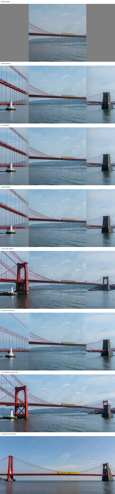

# Local Edit user Clown epsilon workflow reproduction

Date: 2026-09-09

## Verdict

The uploaded workflow was reproduced to within one 8-bit code value per decoded channel (`MAE=0.00195592`, `max_abs=0.00392160`). The matching arm was **D: Clown `epsilon_projection` with no Comfy latent noise mask**, not the nominal A arm.

This is mechanically explained by the serialized workflow: `SetLatentNoiseMask` node 1069 has `mode=4` (bypass). Its visible connection therefore does not put a `noise_mask` into the sampler latent. The real behavioral reference is full-canvas Klein Euler plus RES4LYF's projected epsilon guide.

The positive result does not rehabilitate the falsified two-column scalar transition. It identifies a different mechanism: full-canvas accepted-state evolution, combined with a strong nonlinear batch-global projected derivative correction over the source mask. It also gives up exact source authority; the matching output has nonzero source-region change.

No production node, registration, Blueprint component, or sampler was modified.

## Exact reference inputs

- Model: FLUX.2 Klein 4B W4A8.
- CFG: 1.
- Seed: 0.
- Steps: 8.
- Scheduler: `Flux2Scheduler`, 1024 x 512.
- Sampler: RES4LYF `linear/euler`.
- Source: uploaded 1024 x 1024 bridge image.
- Canvas construction: pad 512 pixels on both horizontal sides, then resize the 2048 x 1024 padded image to 1024 x 512.
- Source placement after resize: center pixel columns 256 through 767; the two 256-pixel sides are editable.
- Guide: VAE encoding of that resized padded canvas. The same encoded latent is the sampler latent before the bypassed `SetLatentNoiseMask` node.
- Prompt: `A wide cinematic photograph of one single long red suspension bridge stretching continuously from the far left edge to the far right edge over calm water, one yellow passenger train centered on the bridge, one white lighthouse at the far left, one dark stone tower at the far right, continuous bridge deck and cables, coherent perspective, no duplicate bridges, trains, lighthouses, or towers`

The exact Clown settings are `epsilon`, `channelwise_mode=false`, `projection_mode=true`, `weight=1`, `cutoff=1`, `constant`, `start_step=0`, `end_step=-1`, and `invert_mask=false`.

## Actual Clown semantics

The installed RES4LYF source and `references/RES4LYF` source are byte-identical for the traced files. The reference contains no Git metadata, so the reproducible revision identifiers are the recorded SHA-256 hashes in [the source audit](../docs/notes/LOCAL_EDIT_USER_CLOWN_EPSILON_WORKFLOW_AUDIT.md).

For Klein's CONST sampling path, RES4LYF uses its linear Runge-Kutta method. After the ordinary model call, CFG/guider combination, and Comfy denoised conversion, it obtains the sampler derivative

```text
d = (x_sigma - x0_model) / sigma
```

For the decreasing-sigma guide row it constructs

```text
g = (x_row - y) / sigma_row
```

where `y` is the clean encoded padded source. Thus Clown's UI label `epsilon` denotes this sampler derivative in the CONST path; it does not reinterpret the raw Klein output as an EPS prediction. The guide is applied after prediction and CFG at the sampler derivative boundary, before the RK/Euler update. The model never sees it.

`ClownGuide_Beta` unconditionally complements the supplied mask. With `invert_mask=false`, the direct outpaint mask—1 on padded/editable pixels and 0 on source pixels—therefore becomes an internal guide mask `G` that is 1 on the center source and 0 on the editable sides. Broadcasting expands it over latent channels.

With `projection_mode=true` and `channelwise_mode=false`, the selected mode is `epsilon_projection`:

```text
q = G*g + (1-G)*0
p = proj_q(d) + (q - proj_d(q))
d_out = d + W*(p-d)
```

The projection flattens every channel and spatial coordinate of each batch item into one vector. It is therefore sample-global, not per-channel and not spatially local. It combines the component of the model derivative parallel to the masked guide vector with the component of the masked guide orthogonal to the model derivative. There is no clipping, norm preservation, magnitude rescaling, or channelwise normalization. With one guide, weight 1, and the constant scheduler, `W=G` after the cutoff test.

`cutoff=1` is a masked Pearson-similarity threshold. It is not a sigma cutoff. Guidance is suppressed only when the measured similarity reaches at least 1; otherwise it remains active across the configured steps.

## The two mask paths

At the image mask boundary, both paths begin with a 1024 x 512 binary outpaint mask: editable side pixels are 1, center source pixels are 0, mean 0.5.

- Guide path: direct resize, then Clown's complement. The consumed guide mask is binary, source-center=1, editable-sides=0, mean 0.5.
- Sampling-mask path: `GrowMaskWithBlur(blur_radius=32)` then resize. The resulting image-space mask has 132 distinct values, mean 0.5, nonzero fraction 0.5791, and exact-one fraction 0.4209.

These paths are semantically different. More importantly, the sampling path is inactive in the uploaded graph because node 1069 is bypassed. In the forced-mask ablation arms, Comfy's `KSamplerX0Inpaint` applies that mask at model-call lifecycle boundaries, while RES4LYF also performs its sampler output blending. The workflow decodes sampler output slot 1 (`denoised`), not output slot 0.

## Reproduction harness and tests

The experiment-only harness is [local_edit_user_clown_epsilon_reproduction.py](local_edit_user_clown_epsilon_reproduction.py). It imports and calls the installed RES4LYF `ClownGuide_Beta` and `ClownsharKSampler_Beta` directly, and uses live ComfyUI model, conditioning, scheduler, VAE, and mask functions. It does not substitute `d_source`, the hard-source sampler, or the two-column transition formula.

The tests in [test_local_edit_user_clown_epsilon.py](test_local_edit_user_clown_epsilon.py) prove the serialized geometry and polarity, soft blurred-mask construction, node selection of `epsilon_projection`, and global/non-plain projection behavior. Result: 4 passed.

## Ablation results

The uploaded PNG is compared against each decoded `denoised` output.

| Arm | Exact mechanism | Uploaded-reference MAE | Locked-source MAE | Editable-change RMS | Visual result |
|---|---|---:|---:|---:|---|
| A | projection + forced blurred noise mask | 0.079581 | 0.036583 | 0.211706 | Loses the large left tower; joins remain visibly discontinuous. |
| B | plain epsilon + forced blurred noise mask | 0.080148 | 0.036883 | 0.212686 | Very close to A/C; projection is largely suppressed/redundant under this lifecycle. |
| C | no guide + forced blurred noise mask | 0.080294 | 0.036875 | 0.212663 | Similar failed join geometry to A/B. |
| D | projection + no noise mask | **0.001956** | 0.041749 | 0.240984 | Reproduces the uploaded nearly continuous single bridge and both terminal structures. |
| E | projection + forced binary noise mask | 0.082208 | 0.043275 | 0.229968 | Sharp mask boundaries and visible joins. |
| F | plain epsilon + no noise mask | 0.057138 | 0.059390 | 0.246025 | Broad bridge continuity, but duplicated/overlapping left bridge/tower structure and greater source drift. |
| G | no guide + no noise mask | 0.147458 | 0.109806 | 0.198314 | Coherent new bridge, but substantial replacement of the source composition and identity. |

The comparison sheet and every final/intermediate decode are in [local_edit_user_clown_epsilon_results](local_edit_user_clown_epsilon_results/).



Simple boundary-gradient metrics do not fully capture duplicated geometry. For D, left/right seam-gradient RMS values are 0.098893/0.054511. F scores lower at 0.065519/0.037677 despite visibly duplicating structure, so perceptual structural inspection remains necessary.

## Per-step correction evidence for the reproduced arm

Telemetry records the primary guide application at each Euler interval.

| Step | Sigma | Guide correction RMS | Correction/model RMS | Plain-epsilon correction RMS | Projection effect vs plain RMS |
|---:|---:|---:|---:|---:|---:|
| 0 | 1.000000 | 1.194818 | 1.0492 | 0.815708 | 0.386550 |
| 1 | 0.982649 | 1.302729 | 1.2376 | 0.813348 | 0.512798 |
| 2 | 0.960430 | 1.175799 | 1.1018 | 0.740952 | 0.452740 |
| 3 | 0.930960 | 1.172170 | 1.0907 | 0.707624 | 0.485941 |
| 4 | 0.889996 | 1.148536 | 1.0337 | 0.668834 | 0.495978 |
| 5 | 0.829187 | 1.097419 | 0.9826 | 0.627442 | 0.487921 |
| 6 | 0.729500 | 1.038311 | 0.9327 | 0.587058 | 0.469995 |
| 7 | 0.536134 | 0.990295 | 0.9412 | 0.569849 | 0.452250 |

The correction is active from the first interval and is comparable to the model derivative throughout. Projection is material at every step. In the forced blurred-mask A arm, correction/model RMS falls from 0.328 at step 0 to roughly 0.08–0.12 thereafter, consistent with the native mask lifecycle making the guide much smaller and largely redundant.

## Why this differs from hard source and the two-column transition

At the primary Euler derivative row, unprojected Clown epsilon over the source mask has the same local correction as replacing the model derivative with `(x-y)/sigma`; the harness confirms zero tensor difference for F. That algebra alone cannot explain D.

D differs in two mechanically decisive ways:

1. It does **not** restore or constrain the accepted source state. The entire canvas evolves through every model call, allowing Klein to construct a globally coherent bridge. G shows that this free full-canvas evolution alone readily creates coherent geometry, though it destroys source identity.
2. It applies the nonlinear, batch-global `epsilon_projection` correction after every prediction. F shows that plain epsilon can retain more source than G while keeping broad continuity, but creates duplicate structure. Projection supplies a substantial global orthogonalized correction and is required for the close reference match.

The hard-source/native-mask experiment enforced exact source trajectory authority and left the adjacent regions to restart. The failed two-column transition then altered only a narrow editable band after prediction. The successful workflow instead trades exact source lock for whole-canvas model evolution plus a global projected source anchor. It is therefore counterevidence to a family-wide rejection of Clown epsilon guidance, but not evidence that exact source authority and this continuity have yet been combined.

## Decision

- Preserve the conclusion that the tested two-column scalar transition is falsified.
- Withdraw any broader reading that epsilon guidance as a family is falsified.
- Treat D—full-canvas Klein Euler plus RES4LYF `epsilon_projection`, no latent noise mask—as the new behavioral reference.
- Do not proceed to model-visible injection, K/V injection, sparse execution, or production architecture yet. The discrepancy is now mechanically explained, but the unresolved research problem is how to retain D's full-canvas/global continuity while making the locked source authoritative.

Machine-readable metrics, settings, source-path evidence, and all per-step records are in [report.json](local_edit_user_clown_epsilon_results/report.json).
