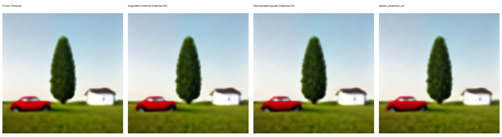

# Phase 46 — `epsilon_projection_cw` discriminator

## Verdict

**Reject and stop the Clown Guide branch.** The fixed arm preserves the coarse
S3 arrangement, but it does not provide a credible structural/detail gain over
Frozen Terminal or the rejected scalar persistent-guidance result. Its
projection increment is also numerically dominant in the worst observed
interval. No production code or public registration changed.

## Fixed contract

- `G=45x45`, `H=128x128`, `F=32x32`, stride `16x16`, `W=64x64`;
- 49 row-major regions with normalized overlap assembly;
- sigmas `[0.25, 0.1986604057521303, 0.14082231971176423,
  0.07516852136507746, 0]`;
- full-one mask, constant base weight `0.25`, cutoff disabled;
- ordinary native-coordinate Klein calls;
- mapped terminal Blueprint, regional noise, and initial W are reused from the
  exact 49-region qualified control.

Only the audited RES4LYF tensor operator was reproduced. The raw model call is
unchanged; projection/channelwise guidance is applied to the sampler derivative
after prediction and before each accepted Euler update.

## Causal and numerical evidence

- Every regional noise, initial-W, and first raw-prediction hash matches the
  exact 49-region one-step control. Divergence starts at the post-model
  projection operation.
- Raw/projected derivative hashes, collinear/orthogonal terms, channelwise
  ratios, increment norms, and every accepted state hash are in `primary.json`.
- Effective channel weights range from `0.18566072` to `0.33552513` despite the
  nominal `0.25` base weight.
- Across 196 local intervals, mean projection-increment ratios are `0.774627`
  of raw-derivative RMS and `0.935686` of W-state RMS. Maxima are `1.417001`
  and `1.612677`. Finite passes; non-dominance fails.
- Final latent hash is
  `deae07b17ff2b88433dda0b6d684f56a2dbd4d2718b894df8c486cc3558f1bb0`
  in both independent executions.

## Geometry, assembly, and residency

- Model calls: 196 per execution, all `1x128x64x64`; zero `H=128x128`
  diffusion-model calls.
- Coverage: `1.0..1.0000001192`; pre-blend overlap RMS: `0.07051743`.
- Peak CUDA allocated/reserved: `3,039,133,184 / 3,560,964,096` bytes.
- Region-barrier allocation range: zero; completed W tensors do not accumulate.
- Primary wall time: `225.98 s`. VAE comparison decoding used ComfyUI's tiled
  fallback and is outside diffusion-model evaluation.

## Semantic review

The decoded arm retains one red car on the left, one tree in the center, one
white house on the right, and a continuous horizon. It introduces no miniature
scene lattice or obvious ringing/channel artifact. Side-by-side review shows no
credible structural improvement: car shape, tree structure, house edges, and
grass remain essentially at the prior refinement frontier. Altered derivative
energy is not accepted as detail.

The exact 49-region one-step artifact supplies causal identity checks. The
persisted unguided four-interval and scalar persistent-guide visual controls
are historical 25-region/stride-24 artifacts; exact 49-region versions do not
exist and were not rerun because this task authorized exactly one new arm.

## Decision

The credible-detail and finite/non-dominant gates are conjunctive and do not
pass. Do not test another weight, projection mode, channelwise toggle, cutoff,
schedule, sampler, or geometry as a continuation of this branch.

